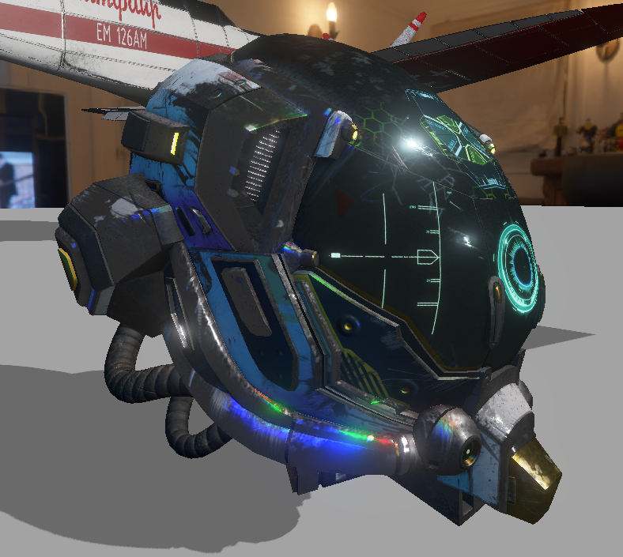
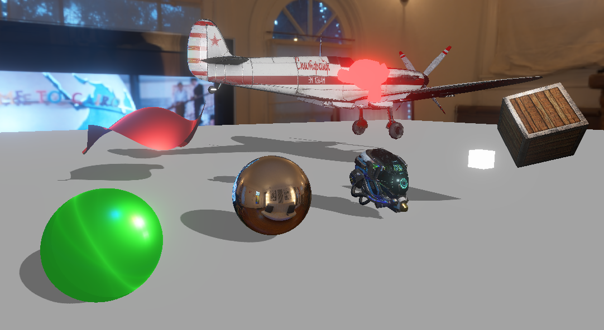
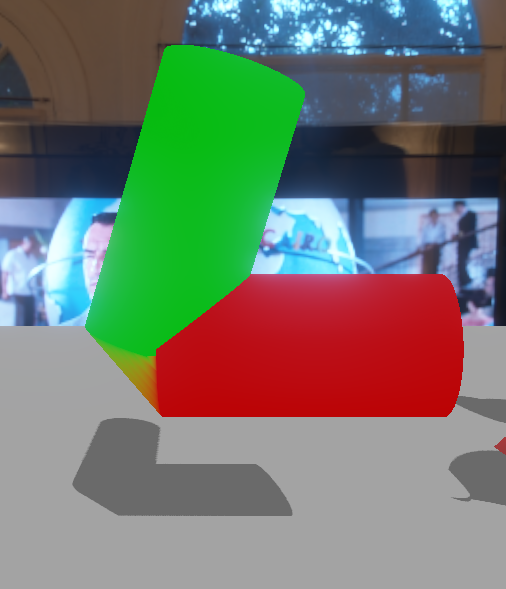
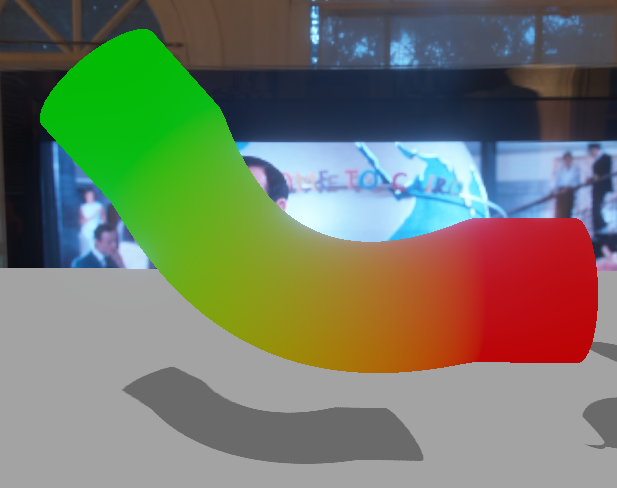

# OpenGLDemos

OpenGL implementation of core 3D graphics concepts.

Features:
- HDR rendering: [Call-of-Duty:Advanced Warface Bloom implementation](https://www.iryoku.com/next-generation-post-processing-in-call-of-duty-advanced-warfare/) + basic tonemapping
- glTF 2.0 model loading and rendering
- Environment mapping
- Cascaded shadow mapping
- Microfacet material model
- Skinning animation (CPU and GPU based)
- Bezier surfaces

## Getting Started

```bash
git clone --recursive https://github.com/Mafo369/OpenGLDemos.git
```

```bash
mkdir build
cd build
cmake -DCMAKE_BUILD_TYPE=Release ../
make
./OpenGLDemos
```

## Results: Bezier Surface


Damaged Helmet



Bloom


Cascaded shadow mapping



Skinning animation





Microfacets


Microfacets modified


Microfacets + texture


Microfacets modified


Lambert


