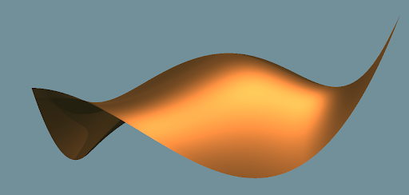
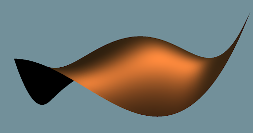
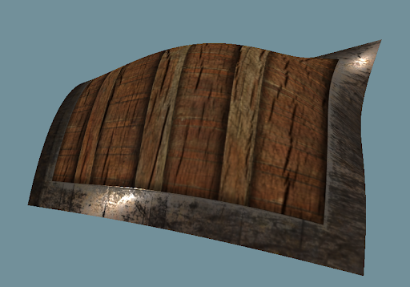
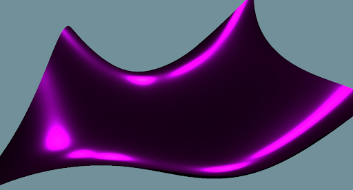
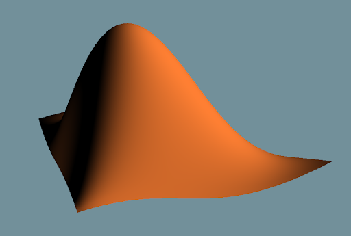
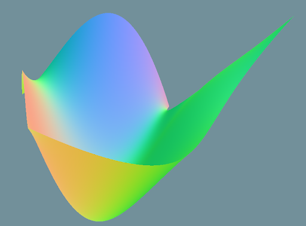
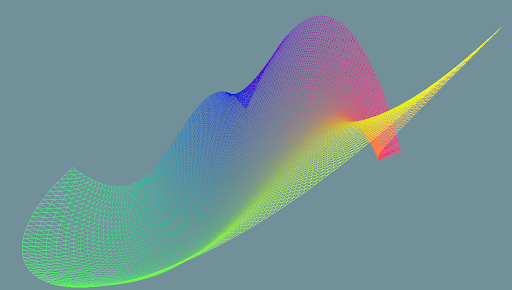
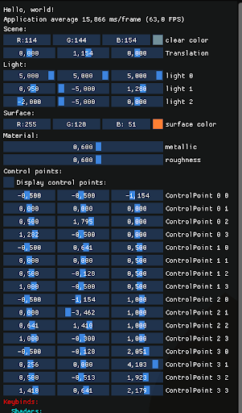

# OpenGLDemos

## IMPORTANT NOTE !!!

**FILE HAS TO BE EXECUTED FROM build/ DUE TO RESSOURCES ACCESS**
**Resizing is kind of broken for the moment**

## Getting Started

```bash
git clone --recursive https://github.com/Mafo369/OpenGLDemos.git
```

```bash
mkdir build
cd build
cmake -DCMAKE_BUILD_TYPE=Release ../
make
./OpenGLDemos
```

## Keybinds:

Shaders:

- glTF 2.0 microfacets
- modified microfacets
- texture microfacets
- simple lambert
- normals
- UV coords

Demos:

- **0** : clear
- **1** : Hello triangle
- **2** : Bezier Surface
- **3** : Hello Sphere
- **4** : Hello Bloom 

## Results: Bezier Surface

Microfacets



Microfacets modified



Microfacets + texture



Microfacets modified



Lambert



Normals



Parametric



Gui


