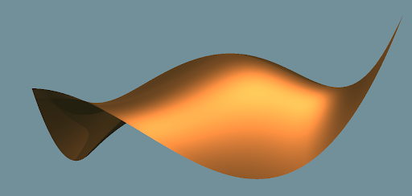
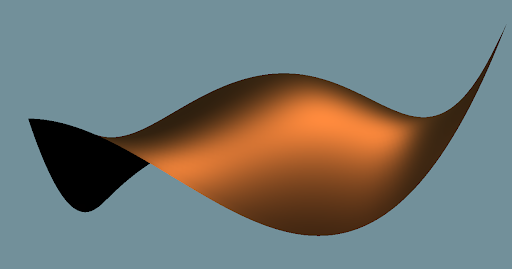
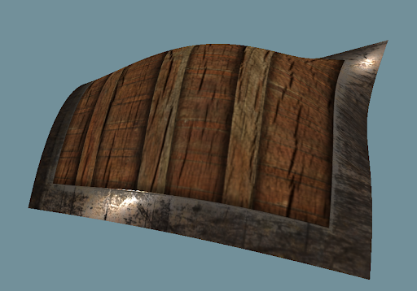
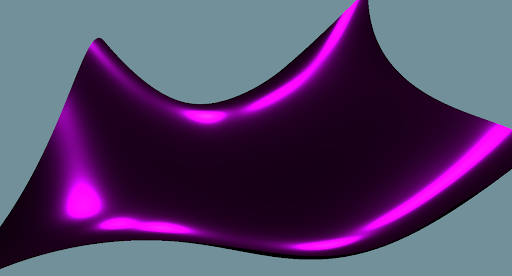
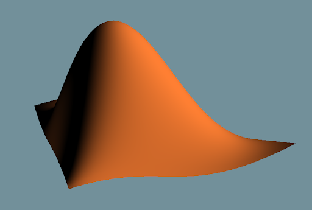
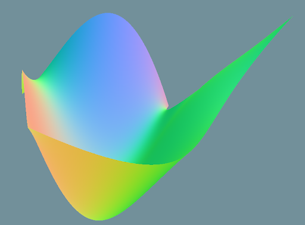
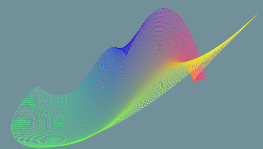

# OpenGLDemos

## IMPORTANT NOTE:

**FILE HAS TO BE EXECUTED FROM bin/ DUE TO RESSOURCES ACCESS LIKE Shaders/ AND Assets/**

## Getting Started

```bash
mkdir build
cmake ..
make
cd ../bin
./helloopenGL
```

## Keybinds:

Shaders:

- **c** : glTF 2.0 microfacets
- **m** : modified microfacets
- **t** : texture microfacets
- **l** : simple lambert
- **n** : normals
- **u** : UV coords

Demos:

- **0** : clear
- **1** : Hello triangle
- **2** : Bezier Surface
- **3** : Hello Sphere

## Results

Microfacets



Microfacets modified



Microfacets + texture



Microfacets modified



Lambert



Normals



Parametric


